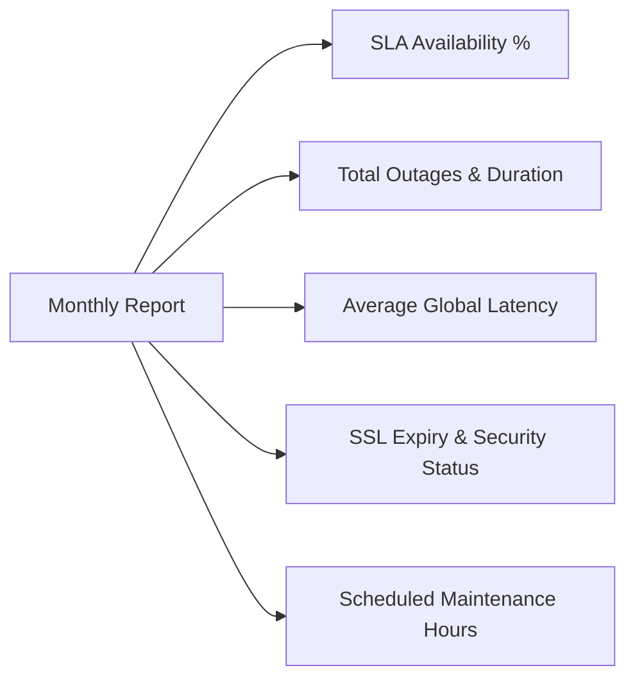

If you sell WordPress website care plans as "we update your plugins, take backups, and keep WordPress updated," you are competing in a race to the bottom. Clients view plugin updates as a commodity chore and frequently cancel after 6 to 12 months when "nothing broke."

To command **$300 to $1,500/month per client**, you need to shift the positioning from administrative maintenance to an **Infrastructure SLA & Revenue Protection Retainer**.

The single most effective tool for proving that value every single month is the **Executive Uptime & Performance Report**.

---

## Why Clients Churn from Low-Tier WordPress Care Plans

Clients don't value tasks; they value outcomes:

| Commodity Care Plan ($50/mo)    | Infrastructure SLA Retainer ($500/mo)                 |
| :------------------------------ | :---------------------------------------------------- |
| "Updated WooCommerce to v9.2.1" | "Maintained 99.98% checkout uptime during flash sale" |
| "Ran 4 database optimizations"  | "Average server response time improved by 42ms"       |
| "Checked security scans"        | "Zero security incidents; SSL renewed automatically"  |
| Invisible work → High churn     | Documented ROI → Indispensable partner                |

When a client receives a branded, easy-to-digest monthly report summarizing their site's 99.99% availability, zero unplanned outages, and fast response times, the retainer invoice becomes a no-brainer to approve.

---

## Key Metrics to Include in a WordPress Uptime Report

Non-technical executives and marketing directors don't want raw server logs. Your report should highlight five essential metrics:

1. **SLA Availability Percentage:** e.g., `99.98% uptime (8m 42s total downtime)`. Compare this against the agreed SLA tier (e.g., 99.9% target).
2. **Total Incident Summary:** Breakdown of any outages, root causes (e.g. host network flap or payment gateway outage), and resolution timestamps.
3. **Response Time & Speed Trends:** Global P95 latency trends across US, EU, and APAC to prove the site remains snappy.
4. **SSL Certificate Health:** Confirmation that HTTPS encryption is active with verified expiration dates.
5. **Scheduled vs. Unscheduled Downtime:** Clearly distinguishing routine maintenance windows from unexpected hosting outages.

---

## Step-by-Step: Adding Uptime Reports to Your Workflow

### Step 1: Establish Your Tiered SLA Retainers

Structure your agency tiers so uptime guarantees and executive reporting are built into higher-value packages:

- **Essential Care ($150/mo):** Weekly updates, basic backups, 99.5% uptime monitoring, quarterly summary.
- **Business SLA ($450/mo):** 60-second multi-region monitoring, 99.9% SLA guarantee, monthly branded PDF uptime report, 1-hour emergency response.
- **Enterprise SLA ($1,200/mo):** 30-second checks, custom white-label status page on client domain, automated monthly PDF reports, dedicated on-call engineer.

### Step 2: Set Up Continuous Probing

Configure checks for your client's core WordPress endpoints:

- Homepage (`/`)
- Dynamic login or cart page to bypass edge caching
- Critical third-party APIs (e.g., Stripe webhooks, CRM webhooks)

### Step 3: Deliver the Report on the 1st of Every Month

Consistency is key. Send the executive report alongside your monthly invoice or schedule it to send automatically via email.

---

## Get the Free Agency Uptime Report Template

If you are just getting started and want a battle-tested template to send to your clients this month, we've built a free interactive spreadsheet and PDF template:

> [!TIP]
> Download our [Free Agency Uptime Report Template (Google Sheets & PDF)](/templates/uptime-report). It includes pre-formatted SLA calculation formulas, executive summary blocks, and client-ready layouts.

---

## How SteadyStack Automates WordPress Reporting for Agencies

Manually compiling screenshots and calculating uptime percentages across 20 clients takes hours every month. SteadyStack completely automates this workflow:

- **Automated Scheduled Monthly PDF Reports:** SteadyStack automatically generates and emails clean executive PDFs to you or directly to your clients on the 1st of each month.
- **100% White-Label:** Your agency logo, colors, and company details. Zero SteadyStack branding or links.
- **Client Workspace Organization:** Organize client sites by account, each with custom alert routing and status pages.
- **Cross-Platform Diagnostic Tools:** Diagnose whether issues are WordPress-specific or upstream third-party service failures using our [Is It Down Directory](/is-down).

[Explore SteadyStack Agency Plans](/pricing) and turn uptime into your agency's most profitable recurring revenue stream.
