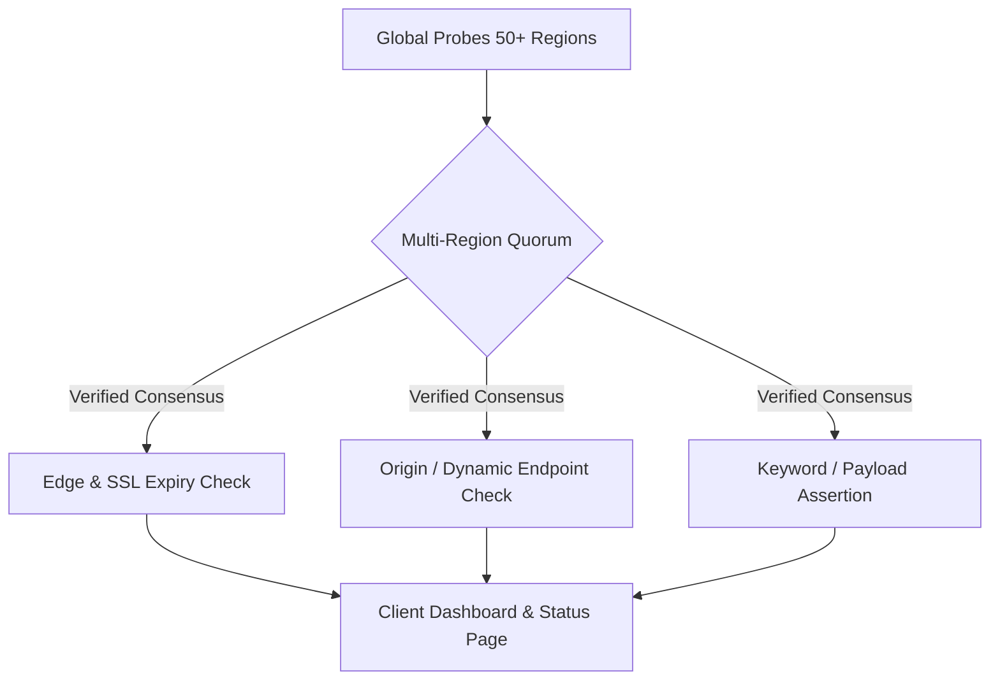

As a web agency or developer managing 10, 50, or 200 client websites, there is a fundamental law of client communication: **If a client discovers their website is down before you do, you have already lost trust.**

Even if the root cause is an expired domain name, an unannounced DNS migration by the client's internal IT team, or a hosting provider outage, the client holds the agency responsible.

Monitoring a portfolio of client websites requires a fundamentally different architecture than monitoring a single SaaS product. Here is the complete playbook for setting up professional client uptime monitoring that scales.

---

## 1. The Pitfalls of Single-Region Monitoring for Agencies

Most agencies start by configuring free or entry-level uptime monitors with basic 5-minute ping checks. Within weeks, they encounter two chronic problems:

### A. The 3:00 AM False Alarm Storm

Single-location monitors trigger outage alerts whenever a transient network hiccup occurs between the probe location and the host server. Waking up an on-call developer or panicking a client account manager for a 12-second BGP route flap destroys team morale.

### B. The "Cached 200 OK" Illusion

Modern websites sit behind CDNs (Cloudflare, Fastly, CloudFront) or edge caching layers. A basic HTTP status check against `https://client.com` might return a clean `200 OK` from the CDN edge cache even while the origin MySQL database is deadlocked and throwing 500 errors on checkout and login paths.

---

## 2. Multi-Check Strategy: What to Actually Monitor

A robust agency monitoring setup tests multiple layers of each client's web infrastructure:

| Check Type             | Target Endpoint                                                    | Purpose                                                                                                  | Recommended Interval |
| :--------------------- | :----------------------------------------------------------------- | :------------------------------------------------------------------------------------------------------- | :------------------- |
| **Homepage & Edge**    | `https://client.com/`                                              | Verifies DNS resolution, TLS certificate validity, and edge availability.                                | 60 seconds           |
| **Bypass Cache / API** | `https://client.com/api/health` or uncached dynamic query          | Verifies origin server, PHP-FPM / Node runtime, and database connection.                                 | 60 seconds           |
| **Keyword Assertion**  | Regex on HTML body (e.g. footer copyright or specific DOM element) | Catches blank white screens ("White Screen of Death") and database connection errors returning HTTP 200. | 60 seconds           |
| **SSL Expiry**         | Automated certificate tracking                                     | Alerts 30, 14, and 7 days prior to SSL certificate expiration.                                           | Daily                |

---

## 3. Eliminating False Positives with Quorum Consensus

To ensure an alert only triggers when a site is genuinely down for real visitors, use **multi-region quorum consensus**.

Instead of alerting on a single probe timeout:

1. When a probe in Virginia detects a timeout, it immediately requests confirmation from probes in Frankfurt, Tokyo, and São Paulo.
2. An outage is confirmed only when a quorum (e.g., 3 out of 3 distinct regions) independently verifies the failure.
3. If only one region fails, the issue is logged as localized routing latency, avoiding middle-of-the-night alerts.

---

## 4. Organizing Monitors by Client Workspaces

Never mix all client monitors into a single unorganized list. Structure your monitoring hierarchy cleanly:

- **Group by Client / Project:** Keep each client's monitors isolated with separate tags, notification channels, and SLA thresholds.
- **Role-Based Alert Routing:** Route high-priority outages to your engineering Slack or Telegram webhook, while routing scheduled maintenance and monthly summary reports to account managers.
- **Dedicated Client Status Pages:** Provide each client with their own status portal hosted under a custom CNAME (e.g. `status.clientbrand.com`).

---

## 5. Delivering Proof of Value with Monthly Reports

Clients don't see the behind-the-scenes work of running updates, monitoring server health, and fixing edge issues. If everything runs smoothly, they eventually question why they are paying a monthly maintenance fee.

Providing an **executive monthly uptime report** changes the conversation from an expense to a documented SLA guarantee.

> [!TIP]
> Need a fast way to provide uptime reports before automating? Download our [Free Agency Uptime Report Template (Google Sheets & PDF)](/templates/uptime-report) to start sending professional monthly deliverables to your clients today.

---

## 6. Automate Your Agency Monitoring Fleet with SteadyStack

SteadyStack is engineered specifically for agencies and developers who manage multi-client fleets:

- **Client-Centric Pricing:** Simple tiers based on client portfolios rather than strict per-monitor micro-billing.
- **White-Label Status Pages & Reports:** Zero SteadyStack branding on status pages, automated PDF reports, and alert notifications.
- **60-Second Multi-Region Checks:** Fast, quorum-verified monitoring across 50+ global edge locations.
- **Third-Party Outage Awareness:** Keep track of major provider outages affecting your client stack via our [Is It Down Directory](/is-down).

[Start monitoring your client fleet for free on SteadyStack](/signup) and automate client reporting in minutes.
