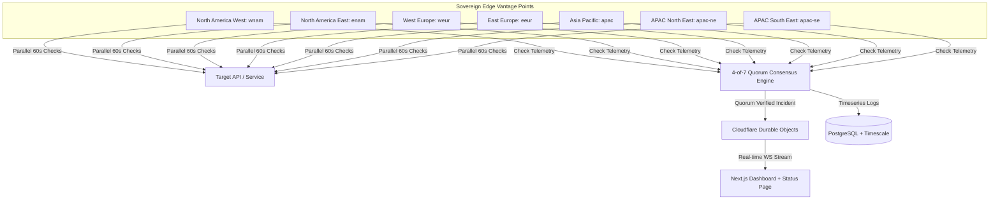

If you have ever spun up a Docker container on a homelab server or a $5 VPS to monitor your side projects, you almost certainly used [Uptime Kuma](https://github.com/louislam/uptime-kuma).

Created by Louis Lam, Uptime Kuma is a masterclass in open-source developer experience: a single `docker run` command, a clean Vue dashboard, an embedded SQLite database, and zero external infrastructure dependencies. It proved that developers were tired of paying $50/month for simple ping checks with artificial limits.

At SteadyStack, we love Uptime Kuma. Many of us ran it for years.

However, as production architectures evolved from monolithic servers to distributed edge microservices and global multi-region deployments, teams running mission-critical workloads started encountering the fundamental physical boundaries of **single-box monitoring**.

This document is an honest, respectful engineering breakdown of how SteadyStack compares to Uptime Kuma, where Uptime Kuma is the right choice, and where edge-native consensus becomes necessary.

---

## 1. Where Uptime Kuma Wins (And When You Should Keep Using It)

Let's be completely transparent: Uptime Kuma is extraordinary for its intended use case.

```
┌────────────────────────────────────────────────────────┐
│ Uptime Kuma: The Champion of the Single Box            │
│                                                        │
│  [Docker Container]                                    │
│    ├── Node.js / Vue.js Dashboard                      │
│    ├── SQLite Database (Embedded)                      │
│    └── Local Socket.io Engine                          │
│                                                        │
│  ✔ Zero cloud accounts needed                          │
│  ✔ Runs completely air-gapped / offline                │
│  ✔ Single docker-compose.yml file                      │
│  ✔ 100% free, forever                                  │
└────────────────────────────────────────────────────────┘
```

**You should choose Uptime Kuma if:**

1. **You want absolute zero-dependency simplicity**: A single container on a Raspberry Pi or local NAS that monitors your Home Assistant instance, Plex server, and local network printers.
2. **You operate in an air-gapped environment**: If your network has zero WAN internet connectivity and cannot reach edge workers or public APIs, Kuma's local SQLite architecture is ideal.
3. **You are monitoring internal homelab resources**: Internal IP addresses (`192.168.1.x` or `10.0.0.x`) where external multi-region verification is irrelevant.

---

## 2. The Physical Limits of Single-Box Monitoring

When companies outgrow Uptime Kuma, it is rarely because of UI aesthetics or feature lists. It is almost always caused by **the laws of distributed networking**:

```
The Single-Box Blindspot:
┌──────────────────┐               [Target API in Frankfurt]
│ Your VPS (Ohio)  │ ──── ISP Hiccup ───✖─── (Ohio-EU Cable Blip)
└──────────────────┘                          │
         │                                    │
    Alerts Fire:                              │
  "API IS DOWN!"                              │
  (3:14 AM Pager)                             │
         │                                    ▼
         ▼                          [Target is 100% Healthy]
  On-call engineer logs on...       (Users in London & Tokyo
  Target was never actually down.    experienced zero downtime)
```

### Problem A: Vantage Point Bias & 3 AM False Alarms

A single server polling from one datacenter has a single vantage point. If a routing table flutters between your monitoring host and Cloudflare, AWS us-east-1, or a trans-Atlantic fiber route, your single box sees packet loss and triggers a high-severity alert.

You wake up at 3:14 AM, check your status page, check your logs, and realize the target API was 100% healthy — only your monitoring VM had a momentary network drop.

### Problem B: Who Monitors the Monitor?

If your monitoring VPS runs out of disk space, suffers an OOM crash from SQLite write locks, or loses network connectivity, **it goes silent**. You don't receive an alert that your server is down, because the machine responsible for alerting is the one that died.

### Problem C: Single-Threaded SQLite Bottlenecks

SQLite is remarkably fast for reads, but sequential write locks during heavy incident flurries (e.g. 200 monitors failing simultaneously during a major cloud outage) can cause event queue backpressure and missed checks.

---

## 3. How SteadyStack Re-Architects Monitoring for the Edge

SteadyStack was engineered specifically to solve the architectural bottlenecks of single-server monitoring without forcing teams into proprietary SaaS vendor lock-in.



### 1. Multi-Region Quorum Consensus (High-Confidence Alerts)

SteadyStack executes continuous parallel checks across **7 sovereign Cloudflare edge regions** (`wnam`, `enam`, `weur`, `eeur`, `apac`, `apac-ne`, `apac-se`).

When a probe detects a non-2xx status code or TCP timeout:

1. It triggers an immediate local double-check to eliminate transient packet glitches.
2. If confirmed, results are evaluated against our **4-of-7 Quorum Consensus Engine**.
3. A global downtime alert is dispatched **only if a majority of independent geographical regions confirm the outage**. If only 1 or 2 regions observe latency or packet loss, SteadyStack classifies it as _Regional Degradation_ rather than waking your team.

### 2. Private Probe Agents for Internal Networks

Have private VPC endpoints, Kubernetes pods, or local databases? SteadyStack ships a lightweight Docker agent (`steadystack-probe`) that connects outbound via WebSocket to report internal metrics back to your dashboard with zero open inbound ports.

### 3. Monitoring as Code & CI/CD Gates

SteadyStack includes a first-class CLI (`pulse`) allowing you to version your monitors in Git:

```yaml
# steadystack.yaml
monitors:
  - name: Production Payment Gateway
    url: https://api.stripe.com/v1/health
    type: HTTP
    interval: 60
    timeout: 5
    method: GET
    expectation:
      statusCode: [200, 204]
      keyword: "operational"
    alertThreshold: 2
```

Apply changes in CI/CD pipelines via `pulse monitors apply` and run deployment health checks with `pulse wait <monitor-id> --timeout 120`.

---

## 4. Head-to-Head Architectural Comparison

| Feature / Dimension        | Uptime Kuma                                | SteadyStack                                                  |
| :------------------------- | :----------------------------------------- | :----------------------------------------------------------- |
| **Primary Architecture**   | Single Docker container (Node.js + SQLite) | Edge-native serverless + Durable Objects + PostgreSQL        |
| **Vantage Points**         | 1 (the single host VM)                     | **7 Sovereign Global Edge Regions**                          |
| **Consensus Protocol**     | None (single-node decision)                | **4-of-7 Multi-Region Quorum Consensus**                     |
| **False-Positive Defense** | Consecutive retry on same box              | Multi-region quorum + double-check protocol                  |
| **Self-Hosting Options**   | Docker / Docker Compose                    | **Docker Compose**, **Kubernetes (Helm)**, or Cloudflare     |
| **Check Frequency**        | Configurable (1s to hours)                 | **30s to 24h** (1m default for all monitors)                 |
| **Private Network Probes** | Requires local container per network       | **Docker-based Probe Daemon** outbound agent                 |
| **Monitoring as Code**     | UI only (or community scripts)             | **Native CLI (`pulse`)** with YAML GitOps sync               |
| **Response Assertions**    | Keyword / Status / JSON query              | **Rust WASM-compiled regex & JSONPath engine**               |
| **Status Pages**           | Built-in basic status pages                | **Custom domains, password protection, i18n, custom CSS/JS** |
| **License & Philosophy**   | MIT (Open Source)                          | **MIT (Open Source)** & Zero Vendor Lock-In                  |

---

## 5. The 10-Second Migration: One-Command Importer

We believe you should own your monitoring data. If you are running Uptime Kuma today, you can migrate your entire fleet to SteadyStack in seconds.

### Step 1: Export from Uptime Kuma

In your Uptime Kuma dashboard, navigate to **Settings** → **Backup** → **Export Backup (JSON)**.

### Step 2: Import into SteadyStack

#### Option A: Via the SteadyStack CLI

```bash
# Preview what will be imported (Dry Run)
pulse import kuma uptime-kuma-backup.json --dry-run

# Execute the live migration
pulse import kuma uptime-kuma-backup.json
```

#### Option B: Via the Web Dashboard

1. Open your SteadyStack dashboard and go to **Settings** → **Migration & Export**.
2. Drag and drop your `uptime-kuma-backup.json` file.
3. Review the parsed monitors (HTTP, TCP, Ping, DNS, Heartbeat) in the live preview table and click **Confirm & Import**.

All check intervals, custom headers, expected status codes, keywords, and tags are automatically mapped and immediately distributed across SteadyStack's global edge network.

---

## 6. Self-Hosting SteadyStack: Our Philosophy

Some companies hide self-hosting behind expensive enterprise tiers or make the setup intentionally painful.

We take the opposite view: **self-hosters are our most valuable community and distribution network.**

Developers who self-host and never pay us a single dollar provide battle-tested feedback, report edge-case network bugs, and write integrations. And when those same engineers join organizations with strict compliance budgets, they bring SteadyStack with them.

You can self-host the complete SteadyStack stack on your own Linux server in under 2 minutes:

```bash
git clone https://github.com/getsteadystack/SteadyStack.git
cd steadystack
cp .env.example .env
docker compose -f docker-compose.prod.yml up -d
```

Read the full [Self-Hosted Installation Guide](/docs/self-hosted) for automated TLS via Caddy, PostgreSQL tuning, and private probe deployment.

---

## Summary: Which Should You Choose?

- **Stay on Uptime Kuma** if you are monitoring a homelab, prefer a single lightweight container with SQLite, or operate on a private air-gapped intranet.
- **Move to SteadyStack** if you run production web applications, cannot tolerate 3 AM false alarms from localized ISP packet loss, need multi-region edge quorum consensus, or want GitOps Monitoring as Code.

Check out [SteadyStack on GitHub](https://github.com/getsteadystack/SteadyStack) to explore the code, deploy your first edge monitor, or import your existing Uptime Kuma configuration today.
