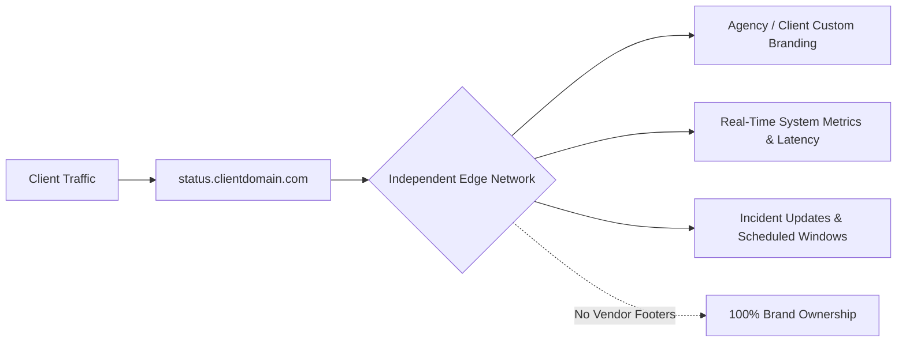

When a client website or critical app goes down, two things happen immediately:

1. The client's inbox and phone lines fill up with complaints from their customers.
2. The agency's support desk gets flooded with panicked emails asking, _"Is the site down? What happened?"_

Without a dedicated status page, your team spends valuable incident response time answering duplicate tickets instead of diagnosing the root cause and deploying a fix.

However, handing a client a generic status page with a conspicuous **"Powered by VendorXYZ"** footer dilutes your agency's brand authority and sends their technical questions into third-party forums.

Here is why **true white-label status pages** are an essential pillar of modern agency infrastructure.

---

## What is a True White-Label Status Page?

A white-label status page is an independent, high-availability status dashboard that looks, feels, and operates as an organic extension of your agency or your client's own brand.

### Key Elements of True White-Labeling:

- **Custom CNAME Domain:** Hosted at `status.clientbrand.com` or `status.youragency.com/client-name` with automatic TLS/SSL certificate issuance and renewal.
- **Zero Vendor Watermarks:** No "Powered by SteadyStack" links, popups, or external affiliate badges.
- **Custom Visual Identity:** Upload custom logos, favicons, dark/light themes, and accent colors matching the client's corporate branding.
- **Custom Notification Sender:** Automated subscriber alerts and incident emails delivered with clean custom sender headers.
- **Multi-Tenant Client Isolation:** Each client only sees their own services, monitors, and historical uptime metrics.

---

## Why Agencies Need White-Label Status Pages

### 1. Deflecting Ticket Floods During Outages

During a widespread cloud outage (such as an AWS US-East-1 degradation or a major DNS provider issue), inbound support inquiries spike 400–800%.

Directing clients to a single, authoritative status portal reassures their executive team that the incident is acknowledged, actively monitored, and under investigation.

> [!TIP]
> Dealing with upstream provider downtime? Check real-time cloud and SaaS health on our [Is It Down Directory](/is-down) to quickly confirm if an outage is localized or global.

### 2. Differentiating Your Agency Retainers

Most freelance developers and budget agencies only offer basic email alerts. By offering a live, 24/7 branded status portal with custom domain SSL, your agency can position its maintenance services alongside enterprise-grade IT managed service providers (MSPs).

### 3. Transparent Scheduled Maintenance

When performing database migrations, CMS core updates, or server reboots, scheduled maintenance banners keep all stakeholders informed well in advance, avoiding unnecessary panic.

---

## White-Label Status Pages Comparison

| Feature                   | Generic Free Status Pages                 | SteadyStack Agency White-Label                             |
| :------------------------ | :---------------------------------------- | :--------------------------------------------------------- |
| **Custom Domain & SSL**   | ❌ Usually paid add-on ($20+/mo per page) | ✅ Included on all Agency plans                            |
| **Vendor Branding**       | ❌ Prominent "Powered By" watermarks      | ✅ 100% Clean — Zero vendor branding                       |
| **Global Edge Uptime**    | ⚠️ Often single-region                    | ✅ 50+ Global Edge Checkpoints                             |
| **Theme Engine**          | ⚠️ Generic default styles                 | ✅ 5 Modern Themes (Dark, Light, Cyberpunk, Matrix, Blade) |
| **Automated PDF Reports** | ❌ Not available                          | ✅ Automated Monthly Executive PDFs                        |

---

## How to Set Up a White-Label Status Page on SteadyStack

Setting up a white-label status portal on SteadyStack takes under two minutes:

1. **Create a Client Workspace:** Add your client under your SteadyStack Agency dashboard.
2. **Select Monitors:** Assign specific website endpoints, APIs, and background cron checks to the client status page.
3. **Configure Custom Branding:** Upload the client's logo, choose a theme, and set custom page titles.
4. **Add CNAME Record:** Point `status.clientdomain.com` to `cname.steadystack.dev` in their DNS provider. SteadyStack automatically provisions and renews the SSL certificate at the Cloudflare edge.
5. **Pair with Monthly Executive Reports:** Pair the live status page with automated monthly PDF reports using our [Free Agency Uptime Report Template](/templates/uptime-report).

---

## Scale Your Agency with SteadyStack

SteadyStack's Agency tier was purpose-built for web agencies, dev shops, and MSPs who manage client portfolios.

[Create your first white-label status page today](/signup) and deliver enterprise-grade reliability to every client you serve.
